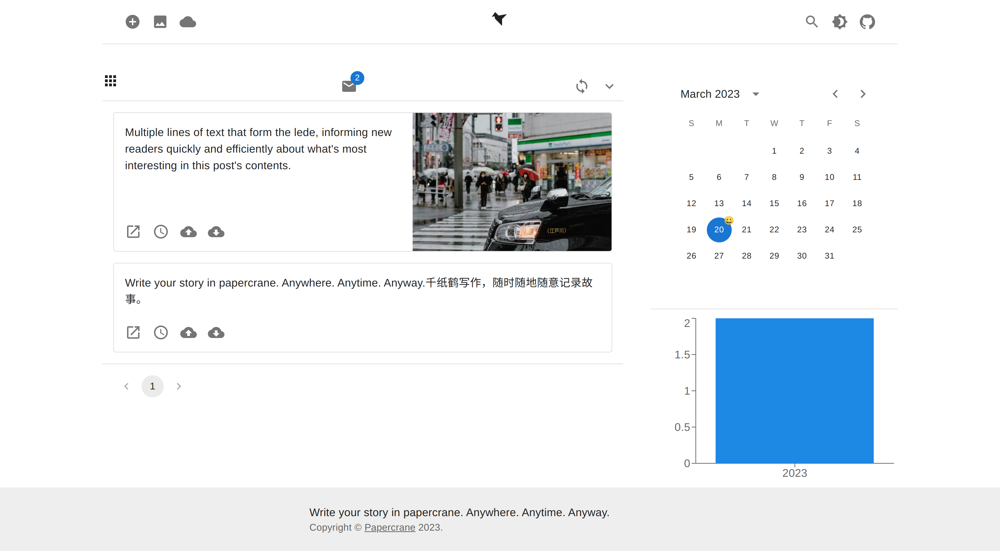

# README


> Write your story in papercrane. Anywhere. Anytime. Anyway.

## Overview

This is a self-hosted writing app, and it looks like



Also, this app has been deployed to free cloud applicaton hosting platform, live preview can be experienced.

[](https://papercrane.onrender.com/)

[](https://crane-website-weld.vercel.app/)

[](https://app.netlify.com/sites/papercrane/deploys)

## Related

[Frontend repo](https://github.com/crane-org/crane-website) and [Backend repo](https://github.com/crane-org/crane-api) have been managed by [crane-org](https://github.com/crane-org) separately.

## Getting started

The simplest way is to build and run the docker container:

```sh
docker run -d -p 8001:8001 surzia/papercrane:latest
```

For local development, use `make` command to build this app:

```sh
make all
```
